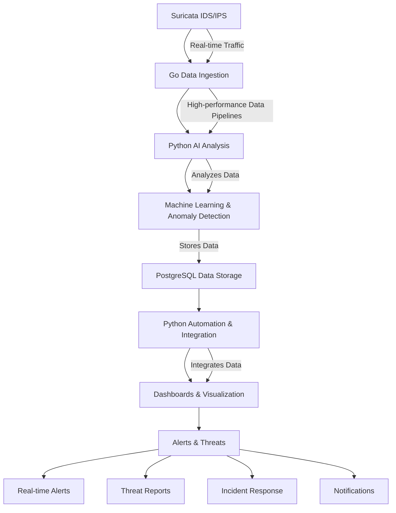

# NexDefend: AI-Powered XDR Platform

**NexDefend** is a unified AI-powered XDR platform designed to protect your organization from evolving threats. It provides real-time threat detection, automated incident response, and unified endpoint and cloud protection.

## Key Features

- **AI-Powered Threat Detection**: Ingests and analyzes Suricata logs in real-time, using machine learning to detect anomalies and potential threats.
- **Unified Protection**: Unifies endpoint security, cloud security, and container security into a single platform.
- **Automated Incident Response**: Streamlines incident reporting and management.
- **Rich Dashboards**: Visualizes security events and system metrics through a comprehensive AI dashboard and Grafana integration.
- **Vulnerability Scanning**: Integrates tools for scanning and managing vulnerabilities.
- **Compliance Reporting**: Generates compliance reports based on system activity.

## Architecture



## Prerequisites

- [Docker](https://docs.docker.com/get-docker/) and [Docker Compose](https://docs.docker.com/compose/install/)
- [Go](https://golang.org/doc/install) (for manual setup)
- [Node.js](https://nodejs.org/en/download/) (for manual setup)
- [PostgreSQL](https://www.postgresql.org/download/) (for manual setup)

## Setup Instructions

### 1. Clone the Repository

```bash
git clone https://github.com/thrive-spectrexq/NexDefend.git
cd NexDefend
```

### 2. Recommended Setup: Docker

This is the easiest and recommended way to get NexDefend running. It uses Docker Compose to start all the required services.

```bash
docker-compose up -d
```

This will start the following services:
- `api`: The Go backend (port 8080)
- `ai`: The Python AI service (port 5000)
- `frontend`: The React frontend (port 3000)
- `db`: The PostgreSQL database (port 5432)
- `prometheus`: The Prometheus server (port 9090)
- `grafana`: The Grafana server (port 3001)

### 3. AI Model Training

Before using the AI-powered features, you need to train the machine learning model. You can do this by sending a `POST` request to the `/train` endpoint of the AI service:

```bash
curl -X POST http://localhost:5000/train
```

### 4. Usage

- **Web Application**: Access the NexDefend frontend at `http://localhost:3000`.
- **AI Dashboard**: Access the AI Dashboard at `http://localhost:3000/dashboard/ai-dashboard`.
- **Grafana Dashboards**: Access Grafana at `http://localhost:3001` (Username: `admin`, Password: `grafana`).

## Contributing

Contributions are welcome! Please feel free to open an issue or submit a pull request.

---

### LICENSE

- This project is licensed under the [GPL-3.0 license](LICENSE)
