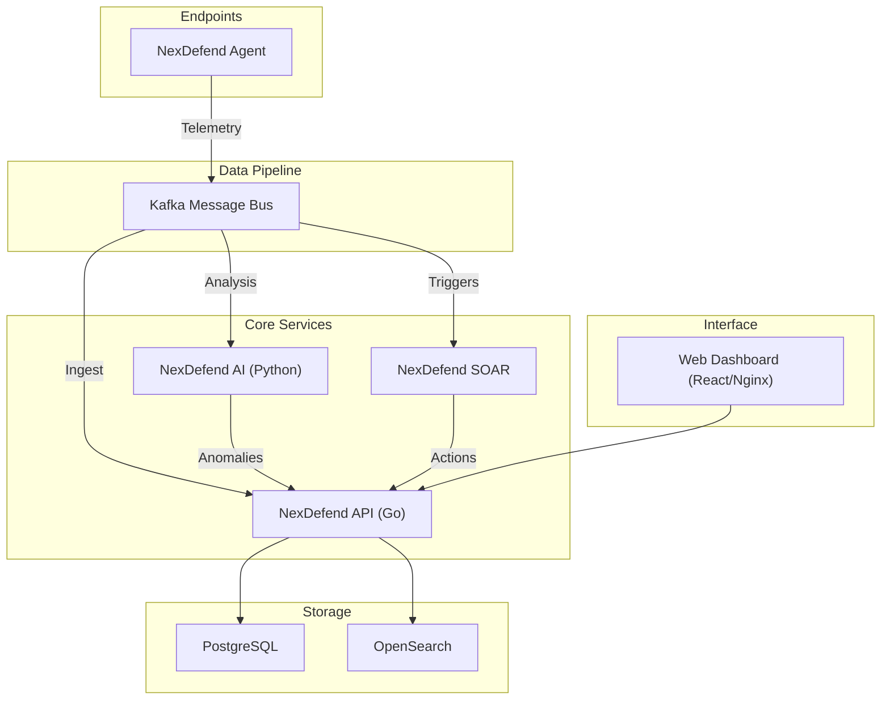

# NexDefend - AI-Powered System Monitoring and Threat Intelligence Platform

Powered by advanced AI and real-time analytics, NexDefend provides deep visibility, automated defense, and predictive intelligence for systems and modern enterprises.

## Main Features

### System Monitoring
* **Resource Usage Tracking**: Real-time monitoring of CPU, Memory, Disk, and Network usage across all endpoints.
* **Process Monitoring**: Deep inspection of running processes to detect anomalies and unauthorized execution.
* **File Integrity Monitoring (FIM)**: Real-time tracking of changes to critical system files to prevent tampering.

### Threat Intelligence
* **AI-Powered Analysis**: Anomaly detection using Isolation Forest and real-time AI scoring of security events.
* **Threat Hunting**: Advanced search capabilities to uncover hidden threats within your network.
* **Vulnerability Detection**: Automated scanning (powered by Nmap and Trivy) to identify open ports and CVEs.

### Automated Remediation
* **Incident Response**: Automated workflow for incident creation, assignment, and tracking.
* **Auto-Scaling**: (Planned) Dynamic resource adjustment based on load and threat levels.
* **IT Hygiene**: Automated compliance checks for SSH, Firewall, and System configurations.

### Cloud Monitoring
* **Container Metrics**: Native integration for monitoring Docker and Kubernetes workloads.
* **Cloud Posture**: Assessment of cloud infrastructure security configurations.
* **Workload Health**: Continuous health checks for distributed cloud services.

### Cognitive Intelligence (GenAI & Predictive)
* **GenAI Copilot ("Sentinel")**: Context-aware AI assistant powered by Ollama (Mistral) for querying system state and threat insights.
* **Predictive Forecasting**: Linear regression modeling to forecast resource usage trends for the next 24 hours.

## Architecture

NexDefend follows a modular microservices architecture designed for scalability and offline deployment:

* **NexDefend Agent**: A lightweight Go binary running on endpoints (Linux/Windows/macOS), collecting telemetry via eBPF/Netlink/WMI and shipping to Kafka.
* **NexDefend API (Go)**: The core backend handling ingestion, correlation, and REST API requests.
* **NexDefend AI (Python)**: A specialized service for Machine Learning (Isolation Forest) and GenAI (Ollama) processing.
* **NexDefend SOAR**: Orchestrates automated responses and playbook execution.
* **Data Layer**:
    * **Kafka**: High-throughput message bus for raw telemetry.
    * **PostgreSQL**: Relational storage for incidents, users, and assets.
    * **OpenSearch**: Indexed storage for massive log volumes and fast search.
* **Frontend**: A modern React application (served via Nginx) for visualization and control.



## Getting Started

### Prerequisites
* Docker Desktop (Windows/Mac) or Docker Engine (Linux)
* Go 1.21+ (For building the Agent)

### Option 1: Enterprise Offline Deployment (Production)
This method creates a standalone installer (.tar.gz) that contains all Docker images, configurations and scripts required to run NexDefend without an internet connection.

#### 1. Build the Installer (On an Online Machine)
Run the build script to compile the code and package all Docker images:

```bash
chmod +x build_installer.sh
./build_installer.sh
```
This will generate a large file named `nexdefend-enterprise-v1.0.0.tar.gz`.

#### 2. Install (On the Target Machine)
Transfer the .tar.gz file to your server or PC.

**Linux:**

```bash
tar -xzf nexdefend-enterprise-v1.0.0.tar.gz
cd nexdefend_installer
sudo ./install.sh
```

**Windows (PowerShell as Admin):**

1. Extract the archive using 7-Zip or tar.
2. Open PowerShell and navigate to the `nexdefend_installer` folder.
3. Run the installer:

```powershell
.\install.ps1
```

**Access the Platform:** Open your browser and navigate to `http://localhost`.

### 🛠️ Option 2: Development Setup (Online)
For active development with hot-reloading and source access.

**Clone the Repository**

```bash
git clone https://github.com/thrive-spectrexq/NexDefend.git
cd NexDefend
```

**Environment Setup**
Copy the example environment files:

```bash
cp .env.example .env
```

**Start Services**

```bash
docker-compose up -d --build
```
Note: The frontend will be available at `http://localhost:3000` (Dev Mode).

## Deploying the Agent
The agent must be compiled for the target operating system.

### Linux
```bash
cd nexdefend-agent
go build -o agent main.go main_linux.go
sudo ./agent
```

### Windows
Open PowerShell in `nexdefend-agent`.

Build the binary:

```powershell
go build -o agent.exe main.go main_windows.go
```

Run as Administrator:

```powershell
.\agent.exe
```

## License
This project is licensed under the GNU GENERAL PUBLIC LICENSE.
