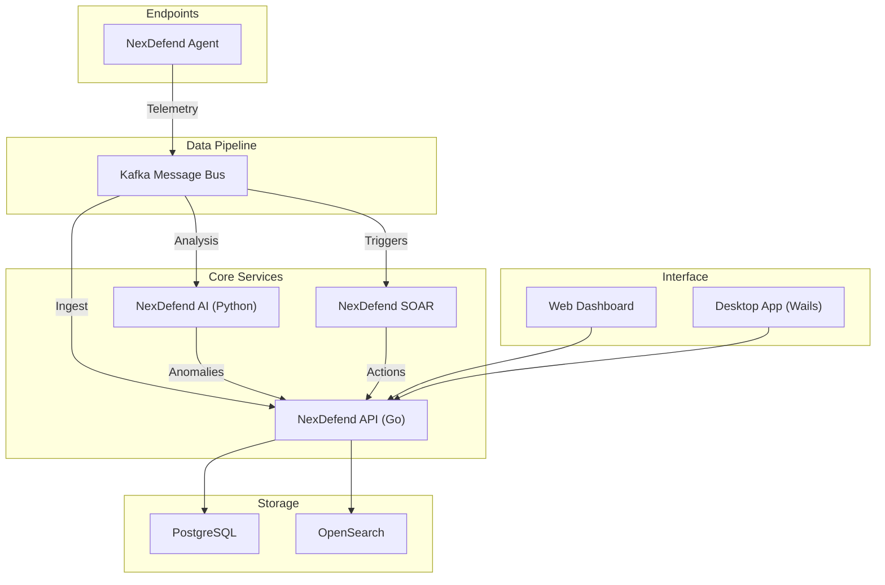

# NexDefend - AI-Powered System Monitoring and Threat Intelligence Platform

Powered by advanced AI and real-time analytics, NexDefend provides deep visibility, automated defense, and predictive intelligence for systems and modern enterprises.

## Main Features

### 🛡️ System Monitoring
* **Resource Usage Tracking**: Real-time monitoring of CPU, Memory, Disk, and Network usage across all endpoints.
* **Process Monitoring**: Deep inspection of running processes to detect anomalies and unauthorized execution.
* **File Integrity Monitoring (FIM)**: Real-time tracking of changes to critical system files to prevent tampering.

### 🔍 Threat Intelligence
* **AI-Powered Analysis**: Anomaly detection using Isolation Forest and real-time AI scoring of security events.
* **Threat Hunting**: Advanced search capabilities to uncover hidden threats within your network.
* **Vulnerability Detection**: Automated scanning (powered by Nmap and Trivy) to identify open ports and CVEs.

### 💻 Automated Remediation
* **Incident Response**: Automated workflow for incident creation, assignment, and tracking.
* **Auto-Scaling**: (Planned) Dynamic resource adjustment based on load and threat levels.
* **IT Hygiene**: Automated compliance checks for SSH, Firewall, and System configurations.

### ☁️ Cloud Monitoring
* **Container Metrics**: Native integration for monitoring Docker and Kubernetes workloads.
* **Cloud Posture**: Assessment of cloud infrastructure security configurations.
* **Workload Health**: Continuous health checks for distributed cloud services.

### 🧠 Cognitive Intelligence (GenAI & Predictive)
* **GenAI Copilot ("Sentinel")**: Context-aware AI assistant powered by Ollama (Mistral) for querying system state and threat insights.
* **Predictive Forecasting**: Linear regression modeling to forecast resource usage trends for the next 24 hours.

## Architecture

NexDefend follows a modular microservices architecture:

*   **NexDefend Agent**: A lightweight Go binary running on endpoints, collecting telemetry via eBPF/Netlink/fsnotify and shipping to Kafka.
*   **NexDefend API (Go)**: The core backend handling ingestion, correlation, and REST API requests.
*   **NexDefend AI (Python)**: A specialized service for Machine Learning (Isolation Forest) and GenAI (Ollama) processing.
*   **NexDefend SOAR**: Orchestrates automated responses and playbook execution.
*   **Data Layer**:
    *   **Kafka**: High-throughput message bus for raw telemetry.
    *   **PostgreSQL**: Relational storage for incidents, users, and assets.
    *   **OpenSearch**: Indexed storage for massive log volumes and fast search.
*   **Frontend**: A modern React application (Web & Desktop via Wails) for visualization and control.



## Getting Started

### Prerequisites
*   Docker & Docker Compose
*   Go 1.21+
*   Python 3.10+
*   Node.js 18+ (for Frontend)

### Installation

1.  **Clone the Repository**
    ```bash
    git clone https://github.com/thrive-spectrexq/NexDefend.git
    cd NexDefend
    ```

2.  **Environment Setup**
    Copy the example environment files:
    ```bash
    cp .env.example .env
    ```

3.  **Start Services**
    Use Docker Compose to bring up the full stack (API, AI, Database, Kafka, OpenSearch):
    ```bash
    docker-compose up -d --build
    ```

4.  **Run the Agent (Linux)**
    Navigate to the agent directory and build/run it:
    ```bash
    cd nexdefend-agent
    go build -o agent main.go linux_watchers.go
    sudo ./agent
    ```

5.  **Access the Dashboard**
    Open your browser and navigate to `http://localhost:3000`.

### Development

*   **Backend (Go)**: Run `go run main.go` from the root.
*   **AI Service**: Run `python nexdefend-ai/api.py`.
*   **Frontend**: `cd nexdefend-frontend && npm install && npm run dev`.

## License
Proprietary / Closed Source (See LICENSE).
