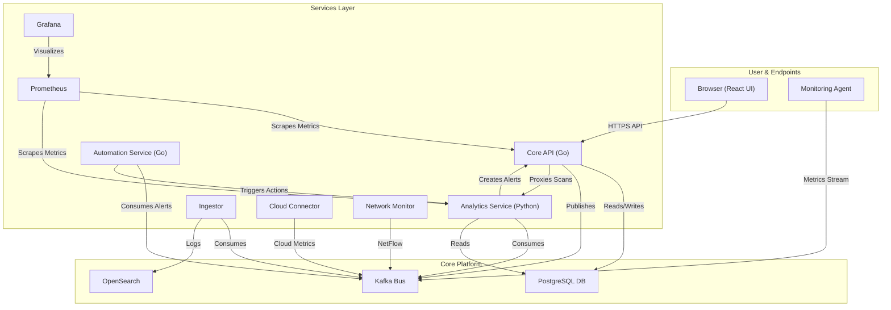

# NexDefend: AI-Powered Systems and Service Monitoring Platform

NexDefend is a comprehensive **AI-Powered Systems and Service Monitoring Platform**. It collects metrics from configured targets at given intervals, evaluates rule expressions, displays the results, and can trigger alerts when specified conditions are observed. It provides a unified dashboard for visualizing the health and performance of your infrastructure.

Built on a modern microservice architecture, NexDefend leverages Go for high-performance data collection, Python for intelligent analytics, Kafka for a resilient event pipeline, and OpenSearch/PostgreSQL for scalable storage.

## Key Features

The platform is a collection of specialized services working in concert to provide end-to-end monitoring.

### 1. Data Collection & Monitoring

*   **Monitoring Agent (nexdefend-agent)**: A lightweight Go agent that provides deep visibility into endpoints and servers. It streams system metrics and events to the pipeline.
    *   **Cross-Platform Support**: Runs on Linux, Windows, and macOS.
    *   **Process Monitoring**: Tracks running processes and resource usage.
    *   **File Integrity Monitoring (FIM)**: Monitors critical files and directories for changes.
    *   **Network Monitoring**: Tracks network connections and traffic flows.
    *   **Log Collection**: Collects and forwards system and application logs.
    *   **Container/Kubernetes Support**: Deploys as a DaemonSet to monitor K8s nodes and pods.
*   **Network Traffic Monitoring**: Ingests network data (NetFlow, sFlow, etc.) to monitor bandwidth usage and traffic patterns.
*   **Cloud Connector (nexdefend-cloud-connector)**: Ingests logs and metrics from cloud providers (AWS, Azure, GCP) and SaaS applications.

### 2. Intelligent Analysis (nexdefend-ai)

*   **AI-Powered Threat Intelligence Platform**: Ingests and correlates threat feeds (e.g., MISP, OTX) with system metrics to identify potential security risks alongside operational issues.
*   **Anomaly Detection**: Uses ML models (`IsolationForest`) to detect deviations from normal baseline metrics.
*   **Automated Alerting**: Automatically generates alerts when anomalies or threshold violations are detected.
*   **Active Service Scanning**: Exposes a `/scan` endpoint to perform active health checks and service discovery (using Nmap) on target hosts.
*   **Behavioral Analytics**: Analyzes historical data to identify long-term trends and unusual behavior patterns.

### 3. Alerting & Automation (nexdefend-soar)

*   **Automated Alert Handlers**: A service that consumes alerts and executes defined playbooks.
*   **Rule Evaluation**: Evaluates rule expressions against incoming data streams to trigger notifications.
*   **Automated Remediation**: Can trigger scripts or API calls to attempt auto-remediation of known issues (e.g., restarting a service, blocking traffic).

### 4. Visualization & Console (api & nexdefend-frontend)

*   **Monitoring Console**: A high-density dashboard designed for operations teams.
    *   **Command Dashboard**: A high-level HUD showing system health scores, active alerts, and metric timelines.
    *   **Alerts Queue**: A real-time view of all active alerts with status tracking and severity filtering.
    *   **Investigation Graph**: Interactive visualization to map dependencies and event sequences.
    *   **Host Management**: Inventory view of all monitored targets with status and grouping.
*   **Global Search**: Instant access to specific hosts, metrics, or logs.
*   **Real-Time Updates**: WebSocket integration for live dashboard updates.
*   **Data Storage**:
    *   **PostgreSQL**: Stores relational data (alerts, users, configurations).
    *   **OpenSearch**: Stores high-volume raw event data and logs.
*   **Observability Stack**:
    *   **Prometheus**: Scrapes internal metrics from NexDefend services.
    *   **Grafana**: Provides pre-built dashboards for monitoring the platform's own performance.

## Architecture

NexDefend operates as a distributed system of specialized microservices communicating via HTTP and a central Kafka event bus.



### Service Overview

| Service           | Language   | Purpose                                                                                |
| ----------------- | ---------- | -------------------------------------------------------------------------------------- |
| `api`             | Go         | The main backend. Handles user auth, data retrieval, and API proxying.                 |
| `frontend`        | TypeScript | The React-based single-page application for the monitoring console.                    |
| `ai`              | Python     | Handles compute-heavy analytics, anomaly detection, and active scanning.               |
| `nexdefend-agent` | Go         | Endpoint agent for collecting metrics, logs, and system events.                        |
| `nexdefend-soar`  | Go         | Listens for alerts on Kafka and executes automated response playbooks.                 |
| `nexdefend-cloud-connector` | Go | Ingests logs and metrics from cloud providers.                                       |
| `db`              | N/A        | PostgreSQL database for storing structured state (alerts, users, etc.).                |
| `opensearch`      | N/A        | Searchable store for all raw logs and events.                                          |
| `kafka`/`zookeeper` | N/A        | Central event bus for decoupling services and handling high-throughput data.           |
| `prometheus`/`grafana` | N/A        | Provides platform-level monitoring and metrics visualization.                          |

## Getting Started

### 1. Prerequisites

*   Docker & Docker Compose
*   Git

### 2. Clone the Repository

```bash
git clone https://github.com/thrive-spectrexq/NexDefend.git
cd NexDefend
```

### 3. Create Environment Files

You must create two `.env` files.

#### `.env` (in the root directory)

```
# Database
DB_USER=nexdefend
DB_PASSWORD=password
DB_NAME=nexdefend_db
DB_HOST=localhost
DB_PORT=5432
DB_SSLMODE=disable

# Service Communication
API_PREFIX=/api/v1
PYTHON_API=http://localhost:5000
CORS_ALLOWED_ORIGINS=http://localhost:3000,http://localhost:5173

# Secrets (MUST change in production)
JWT_SECRET_KEY=my_super_secure_user_jwt_secret_key_123!@#
AI_SERVICE_TOKEN=my_secure_service_to_service_token_abc987

# Features
FIM_PATH=/etc
```

#### `nexdefend-ai/.env`

```
# Database
DB_NAME=nexdefend_db
DB_USER=nexdefend
DB_PASSWORD=password
DB_HOST=localhost
DB_PORT=5432

# Service Communication
GO_API_URL=http://localhost:8080/api/v1
AI_SERVICE_TOKEN=my_secure_service_to_service_token_abc987
```

### 4. Run with Docker Compose

This is the recommended method to start all services.

```bash
docker-compose up -d --build
```

### 5. Train the Anomaly Model

After the services are running, you must train the initial anomaly detection model.

```bash
curl -X POST http://localhost:5000/train
```

### 6. Access the Application

*   **NexDefend Console**: `http://localhost:3000`
*   **Grafana**: `http://localhost:3001` (admin:grafana)
*   **Prometheus**: `http://localhost:9090`
*   **OpenSearch**: `http://localhost:9200`
*   **OpenSearch Dashboards**: `http://localhost:5601`

## License

This project is licensed under the GNU General Public License v3.0.
