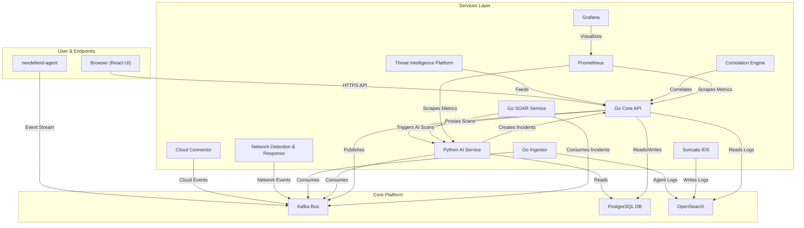

# NexDefend: AI-Powered XDR Platform

NexDefend is a unified, cloud-native XDR (Extended Detection and Response) platform designed to protect organizations from evolving threats. It integrates endpoint monitoring, network security, AI-driven anomaly detection, and automated incident response into a single, cohesive system.

Built on a modern microservice architecture, NexDefend leverages Go for high-performance API services, Python for AI/ML analytics, Kafka for a resilient event pipeline, and OpenSearch for large-scale log storage and search.

## Key Features

The platform is a collection of specialized services working in concert.

### 1. Detection & Data Collection

*   **Endpoint Agent (nexdefend-agent)**: A lightweight Go agent that provides deep endpoint visibility. It streams security-relevant events to the Kafka pipeline.
    *   **Cross-Platform Support**: The agent is designed to run on both Linux, Windows and macOS environments.
    *   **Process Monitoring**: Captures process creation events, including PID, name, and command line arguments.
    *   **File Integrity Monitoring (FIM)**: Uses `fsnotify` to monitor critical files and directories (e.g., `/etc`) for unauthorized changes.
    *   **Network Connection Monitoring**: Tracks new network connections, linking them to specific processes.
    *   **Windows Event Log Collection**: On Windows, the agent collects and forwards security-relevant event logs.
    *   **Container/Kubernetes Support**: The agent can be deployed as a DaemonSet in Kubernetes to monitor K8s audit logs and container runtime events.
    *   **Osquery Integration**: Allows analysts to run live SQL queries against the fleet from the NexDefend UI.
*   **Network Detection & Response (NDR)**: The platform ingests network data from sources like NetFlow, sFlow, Zeek, or Suricata.
*   **Malware Hash Detection**: All file uploads are checked against a known malware hash registry stored in the database.
*   **Cloud Connector (nexdefend-cloud-connector)**: A dedicated service for ingesting security logs and events from cloud providers (e.g., AWS CloudTrail, Azure Monitor, Google Cloud Logging) and SaaS applications (e.g., Okta, Google Workspace, Microsoft 365).

### 2. AI & Analytics (nexdefend-ai)

*   **ML Anomaly Detection**: Uses a pre-trained `IsolationForest` model to detect anomalies in Suricata event data. A dedicated `/train` endpoint allows for retraining the model.
*   **Automated Incident Creation**: The AI service automatically creates "Critical" or "High" severity incidents in the backend when anomalies are detected.
*   **Active Vulnerability Scanning**: Exposes a secure `/scan` endpoint that uses Nmap to perform on-demand port scanning, automatically creating vulnerability records for any open ports discovered.
*   **User & Entity Behavior Analytics (UEBA)**: A background worker consumes agent events from Kafka to perform behavioral analysis and detect anomalies.
*   **MITRE ATT&CK Mapping**: Detected threats and anomalies are automatically mapped to specific MITRE ATT&CK techniques.
*   **Advanced Threat Detection**: The platform uses advanced threat detection models, such as those based on Natural Language Processing (NLP) for analyzing textual logs (e.g., PowerShell scripts, command-line arguments) and detecting DGA domains.
*   **Threat Intelligence Platform (TIP)**: Ingests threat intelligence feeds (e.g., MISP, Abuse.ch, OTX) and correlates all incoming data against these IOCs in real-time.

### 3. Response & Orchestration (nexdefend-soar)

*   **Automated SOAR Playbooks**: A Go-based SOAR (Security Orchestration, Automation, and Response) service consumes from the `incidents` Kafka topic.
*   **Incident-Driven Response**: When a "High" or "Critical" incident is detected, the SOAR service automatically triggers a playbook, such as initiating an Nmap scan on the incident's source IP.
*   **Robust Playbook Engine**: The platform includes a robust playbook engine that allows for the creation of complex, multi-step automation workflows.
*   **Automated Response Actions**: The platform supports a wide range of automated response actions, such as isolating an endpoint from the network, terminating a malicious process, or blocking an IP address at the firewall.

### 4. Platform & UI (api & nexdefend-frontend)

*   **Cyber-Tactical Console Interface**: A dark-themed, high-density console designed for SOC analysts, featuring neon accents and real-time data visualization.
    *   **Command Dashboard**: A high-level HUD showing security scores, active threats, and detection volume timelines.
    *   **Detections Queue**: A real-time, sortable, and filterable view of all security alerts with status tracking.
    *   **Investigation Graph**: Interactive process tree visualization using `@xyflow/react` to map attack lineages (e.g., Process spawning Process -> Network Connection).
    *   **Host Management**: Inventory view of all monitored endpoints with status and policy group filtering.
*   **Global Omnibar**: Instant search capability to jump to specific hosts, IP addresses, or detection records.
*   **Real-Time Interactions**: WebSocket integration for live alert streaming and immediate dashboard updates.
*   **Full Incident Management**: A complete case management system for analysts to create, read, update, and resolve security incidents.
*   **SOAR Playbook Editor**: A dedicated UI for building and managing automated response playbooks.
*   **Secure Authentication**: Employs JWT-based authentication with a secure, public-facing landing page and a protected console environment.
*   **Centralized Data Storage**:
    *   **PostgreSQL**: Serves as the primary database for structured, relational data (incidents, vulnerabilities, users, metrics, etc.).
    *   **OpenSearch**: Used as the high-throughput data store for all raw agent events (processes, FIM, net connections) ingested from Kafka.
*   **Observability**:
    *   **Prometheus**: Scrapes metrics from the Go API, Python AI service, and other services.
    *   **Grafana**: Provides pre-built dashboards for monitoring the AI service's performance, Kafka health, and container overview.
*   **Agent Management**: A dedicated API for agent registration and configuration management.
*   **Asset & Identity Enrichment**: Connectors to Active Directory / Okta / Azure AD and CMDBs (like ServiceNow) to enrich asset and identity data.
*   **Embedded Dashboards**: The UI now includes embedded Grafana panels for a seamless user experience.

## Architecture

NexDefend operates as a distributed system of specialized microservices communicating via HTTP and a central Kafka event bus.



### Service Overview

| Service           | Language   | Purpose                                                                                |
| ----------------- | ---------- | -------------------------------------------------------------------------------------- |
| `api`             | Go         | The main backend. Handles user auth, all CRUD operations, and API-to-AI proxying.        |
| `frontend`        | TypeScript | The React-based single-page application for all user interaction.                      |
| `ai`              | Python     | Handles all compute-heavy and specialized tasks: ML/AI, Nmap scanning, and UEBA.       |
| `nexdefend-agent` | Go         | Endpoint agent for collecting and streaming telemetry (FIM, process, network).         |
| `nexdefend-soar`  | Go         | Listens for high-severity incidents on Kafka and runs automated response playbooks.      |
| `nexdefend-cloud-connector` | Go | Ingests security logs and events from cloud providers.                               |
| `db`              | N/A        | PostgreSQL database for storing state (incidents, users, vulnerabilities, etc.).       |
| `opensearch`      | N/A        | Searchable log store for all raw endpoint events.                                      |
| `kafka`/`zookeeper` | N/A        | The central event bus for decoupling services and handling high-throughput event data. |
| `suricata`        | N/A        | Network IDS. Shares its log volume with the `api` service for ingestion.                 |
| `prometheus`/`grafana` | N/A        | Provides platform-level monitoring and metrics visualization.                          |
| `tip`             | Go         | Ingests threat intelligence feeds and correlates IOCs.                               |
| `correlation-engine` | Go      | Links events and creates high-fidelity alerts.                                       |
| `ndr`             | Go         | Ingests network data from sources like NetFlow, sFlow, Zeek, or Suricata.            |

## Getting Started

### 1. Prerequisites

*   Docker & Docker Compose
*   Git

### 2. Clone the Repository

```bash
git clone https://github.com/thrive-spectrexq/NexDefend.git
cd NexDefend
```

### 3. Create Environment Files

You must create two `.env` files.

#### `.env` (in the root directory)

```
# Database
DB_USER=nexdefend
DB_PASSWORD=password
DB_NAME=nexdefend_db
DB_HOST=localhost
DB_PORT=5432
DB_SSLMODE=disable

# Service Communication
API_PREFIX=/api/v1
PYTHON_API=http://localhost:5000
CORS_ALLOWED_ORIGINS=http://localhost:3000,http://localhost:5173

# Secrets (MUST change in production)
JWT_SECRET_KEY=my_super_secure_user_jwt_secret_key_123!@#
AI_SERVICE_TOKEN=my_secure_service_to_service_token_abc987

# Features
FIM_PATH=/etc
```

#### `nexdefend-ai/.env`

```
# Database
DB_NAME=nexdefend_db
DB_USER=nexdefend
DB_PASSWORD=password
DB_HOST=localhost
DB_PORT=5432

# Service Communication
GO_API_URL=http://localhost:8080/api/v1
AI_SERVICE_TOKEN=my_secure_service_to_service_token_abc987
```

### 4. Run with Docker Compose

This is the recommended method to start all services.

```bash
docker-compose up -d --build
```

### 5. (Optional) Populate Sample Data

If the `suricata_events` table is empty, you may need to run a one-time script to populate it from the `sample_eve.json` for the AI model to have data.

### 6. Train the AI Model

After the services are running, you must train the initial AI model.

```bash
curl -X POST http://localhost:5000/train
```

### 7. Access the Application

*   **NexDefend UI**: `http://localhost:3000`
*   **Grafana**: `http://localhost:3001` (admin:grafana)
*   **Prometheus**: `http://localhost:9090`
*   **OpenSearch**: `http://localhost:9200`
*   **OpenSearch Dashboards**: `http://localhost:5601`

## License

This project is licensed under the GNU General Public License v3.0.
