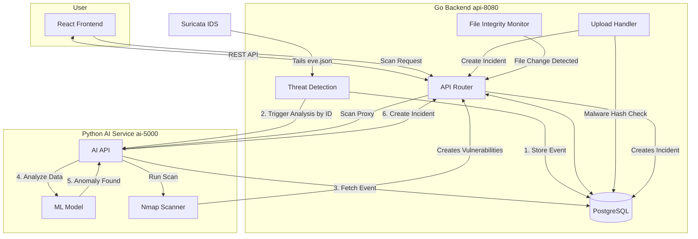

# NexDefend: AI-Powered XDR Platform

**NexDefend** is a unified AI-powered XDR platform designed to protect your organization from evolving threats. It provides real-time threat detection, automated incident response, and unified endpoint and cloud protection.

## Key Features

- **Real-time Threat Detection**: Ingests and analyzes Suricata logs in real-time.
- **AI-Powered Analysis**: Utilizes machine learning (Isolation Forest) to detect anomalies in network traffic and trigger alerts.
- **Automated Incident Response**: Automatically creates incidents in the dashboard when the AI detects a high-confidence anomaly.
- **Endpoint Security**:
    - **File Integrity Monitoring (FIM)**: Actively monitors critical files and creates "Critical" incidents on any modification.
    - **Malware Detection**: Checks file uploads against a known malware hash registry.
- **Threat Intelligence**:
    - **Active Vulnerability Scanning**: On-demand Nmap scanning to discover open ports and vulnerabilities on any host.
    - **Threat Hunting**: Filter and search all ingested Suricata logs.
- **Security Operations**:
    - **Incident Management**: A full-featured UI to track, triage, and manage the lifecycle of security incidents.
    - **Vulnerability Management**: Triage and manage discovered vulnerabilities from "Detected" to "Resolved".
- **Rich Dashboards**: Visualizes security events and system metrics through a comprehensive React dashboard and Grafana integration.

## Architecture



## Prerequisites

- [Docker](https://docs.docker.com/get-docker/) and [Docker Compose](https://docs.docker.com/compose/install/)
- [Go](https://golang.org/doc/install) (for manual setup)
- [Node.js](https://nodejs.org/en/download/) (for manual setup)
- [PostgreSQL](https://www.postgresql.org/download/) (for manual setup)

## Setup Instructions

### 1. Clone the Repository

```bash
git clone https://github.com/thrive-spectrexq/NexDefend.git
cd NexDefend
```

### 2. Create Environment Files

You must create two .env files. Generate your own secure keys.

.env (for Go Backend)

```bash
DB_USER=nexdefend
DB_PASSWORD=password
DB_NAME=nexdefend_db
DB_HOST=localhost
DB_PORT=5432
DB_SSLMODE=disable
API_PREFIX=/api/v1
PYTHON_API=http://localhost:5000

# SECRETS
JWT_SECRET_KEY=YOUR_OWN_RANDOM_USER_JWT_SECRET
AI_SERVICE_TOKEN=YOUR_OWN_SHARED_SERVICE_TOKEN

# FEATURES
FIM_PATH=.
```

nexdefend-ai/.env (for Python AI Service)

```bash
DB_NAME=nexdefend_db
DB_USER=nexdefend
DB_PASSWORD=password
DB_HOST=localhost
DB_PORT=5432

# SERVICE COMMUNICATION
GO_API_URL=http://localhost:8080/api/v1
AI_SERVICE_TOKEN=YOUR_OWN_SHARED_SERVICE_TOKEN
```

### 3. Recommended Setup: Docker

This is the easiest and recommended way to get NexDefend running. It uses Docker Compose to start all the required services.

```bash
docker-compose up -d --build
```

This will start the following services:
- `api`: The Go backend (port 8080)
- `ai`: The Python AI service (port 5000)
- `frontend`: The React frontend (port 3000)
- `db`: The PostgreSQL database (port 5432)
- `prometheus`: The Prometheus server (port 9090)
- `grafana`: The Grafana server (port 3001)

### 4. AI Model Training

After starting the services, you must train the AI model by sending a POST request to the AI service.

```bash
curl -X POST http://localhost:5000/train
```

### 4. Usage

- **Web Application**: Access the NexDefend frontend at `http://localhost:3000`.
- **Go API**: Access the Go API backend at `http://localhost:8080`.
- **Python AI API**: Access the Python AI API backend at `http://localhost:5000`.
- **Grafana Dashboards**: Access Grafana at `http://localhost:3001` (Username: `admin`, Password: `grafana`).

## Contributing

Contributions are welcome! Please feel free to open an issue or submit a pull request.

---

### LICENSE

- This project is licensed under the [GPL-3.0 license](LICENSE)
