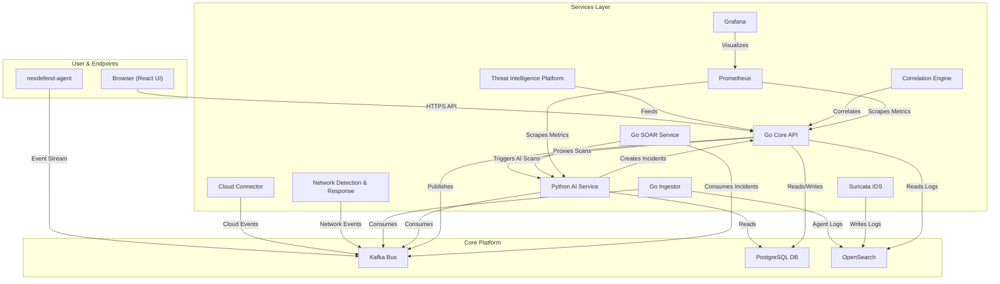

# NexDefend Architecture

NexDefend operates as a distributed system of specialized microservices communicating via HTTP and a central Kafka event bus.

```mermaid
graph TD

%% Global direction
    direction TB

%% ========= USER & ENDPOINTS =========
    subgraph U["User & Endpoints"]
        direction TB
        F["Browser (React UI)"]
        A["nexdefend-agent"]
    end

%% ========= CORE PLATFORM =========
    subgraph C["Core Platform"]
        direction LR
        K["Kafka Bus"]
        DB["PostgreSQL DB"]
        OS["OpenSearch"]
    end

%% ========= SERVICES LAYER =========
    subgraph SVC["Services Layer"]
        direction TB
        API["Go Core API"]
        AI["Python AI Service"]
        SOAR["Go SOAR Service"]
        I["Go Ingestor"]
        SUR["Suricata IDS"]
        CC["Cloud Connector"]
        TIP["Threat Intelligence Platform"]
        CE["Correlation Engine"]
        NDR["Network Detection & Response"]
        P["Prometheus"]
        G["Grafana"]
    end

%% ========= CONNECTIONS =========

%% Frontend and Agents
    F -->|HTTPS API| API
    A -->|Event Stream| K
    CC -->|Cloud Events| K
    NDR -->|Network Events| K

%% Ingestor Flow
    I -->|Consumes| K
    I -->|Agent Logs| OS

%% AI Service
    AI -->|Consumes| K
    AI -->|Creates Incidents| API
    AI -->|Reads| DB

%% Core API
    API -->|Reads/Writes| DB
    API -->|Publishes| K
    API -->|Proxies Scans| AI

%% SOAR
    SOAR -->|Consumes Incidents| K
    SOAR -->|Triggers AI Scans| AI

%% TIP & CE
    TIP -->|Feeds| API
    CE -->|Correlates| API

%% Observability
    P -->|Scrapes Metrics| API
    P -->|Scrapes Metrics| AI
    G -->|Visualizes| P

%% Suricata
    SUR -->|Writes Logs| OS
    API -->|Reads Logs| OS
```
